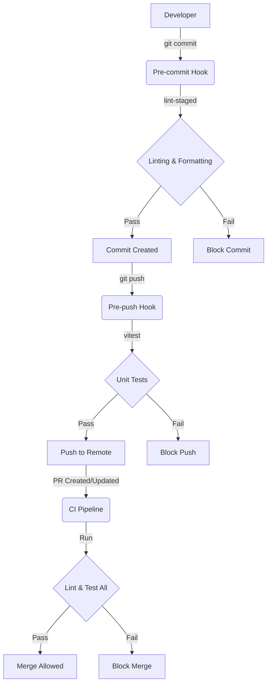

# Technical Implementation Plan: Automated Code Quality Workflows

**Feature**: Automated Code Quality Workflows  
**Status**: Draft  
**Related Spec**: [spec.md](./spec.md)

## 1. Architecture Overview

This feature integrates a multi-layered quality control system using Git hooks and CI pipelines. It adheres to the "Shift Left" philosophy, detecting errors as early as possible in the development lifecycle.

### High-Level Design

### Component Strategy

1.  **Local Environment (Hooks)**:
    -   **Husky**: Orchestrates git hooks.
    -   **lint-staged**: Optimizes pre-commit checks by running only on changed files.
    -   **ESLint/Prettier**: Enforces code style and catches syntax errors.
    -   **Vitest**: Runs fast unit tests before pushing.

2.  **CI Environment (GitHub Actions)**:
    -   **CI Workflow**: Runs comprehensive checks on every PR and push to main. It serves as the authoritative gatekeeper.

## 2. Technology Stack

-   **Git Hooks Manager**: `husky` (v9+)
-   **Staged File Linter**: `lint-staged`
-   **Linter**: `eslint` (existing)
-   **Formatter**: `prettier` (existing)
-   **Test Runner**: `vitest` (existing)
-   **CI Provider**: GitHub Actions

## 3. Implementation Steps

### Phase 1: Local Git Hooks Setup

**Objective**: Configure Husky and lint-staged to intercept commits and pushes.

1.  **Install & Configure Husky**:
    -   Initialize husky in the root directory.
    -   Add `prepare` script to `package.json`.

2.  **Configure Pre-commit Hook**:
    -   Install `lint-staged`.
    -   Create `.lintstagedrc` (or configure in package.json) to handle both `apps/web` and `apps/server`.
    -   Rule: `*/*.{ts,tsx,js,jsx}` -> `eslint --fix`, `prettier --write`.
    -   Create `.husky/pre-commit` hook to run `lint-staged`.

3.  **Configure Pre-push Hook**:
    -   Create `.husky/pre-push` hook.
    -   Command: Run `pnpm test` (which triggers `vitest run` in workspaces).
    -   Optimization: Consider running only relevant workspace tests if possible, but comprehensive run is safer for `pre-push`.

### Phase 2: CI Pipeline Refinement

**Objective**: Ensure the `ci.yml` strictly enforces the same standards as local hooks.

1.  **Verify CI Workflow**:
    -   Ensure `ci.yml` runs `lint` and `test` for all workspaces and packages.
    -   (Already verified in `001`, but double-check consistency).

### Phase 3: Monorepo Integration

**Objective**: Ensure tools work correctly across `apps/server`, `apps/web`, and shared packages.

1.  **Lint-staged Configuration**:
    -   Must properly map file paths to the correct sub-project config.
    -   Since it runs from root, standard config content usually handles this well.

2.  **Testing Strategy**:
    -   `pnpm test` from root usually runs tests in all workspaces. This is acceptable for pre-push unless it becomes too slow (>30s).

## 4. Work Logic & Data Flow

**Pre-commit Logic**:
1.  Developer runs `git commit`.
2.  Husky triggers `.husky/pre-commit`.
3.  Script invokes `npx lint-staged`.
4.  `lint-staged` filters staged files.
5.  If files match pattern:
    -   Run `eslint --fix`.
    -   Run `prettier --write`.
    -   `git add` changes (if modification happened).
6.  If exit code 0, commit proceeds. Else, abort.

**Pre-push Logic**:
1.  Developer runs `git push`.
2.  Husky triggers `.husky/pre-push`.
3.  Script runs `pnpm test`.
4.  If exit code 0, push proceeds. Else, abort.

## 5. Risk Assessment

| Risk | Impact | Mitigation |
|------|--------|------------|
| Hooks not executable on some OS | Developers cannot commit | Ensure husky sets execute permissions; verify on Windows/Linux/Mac. |
| Pre-push check too slow | Developer friction | Allow bypass (`--no-verify`) for emergency; optimize test suite performance. |
| Monorepo path issues | Linting incorrect file sets | Use relative paths correctly in `lint-staged` config. |

## 6. Verification Plan

1.  **Local Commit Test**: Change a file to violate lint rules, try to commit -> Must fail.
2.  **Local Push Test**: Break a test, try to push -> Must fail.
3.  **CI Parity Test**: Ensure a PR that passes local checks also passes CI (same rules).
