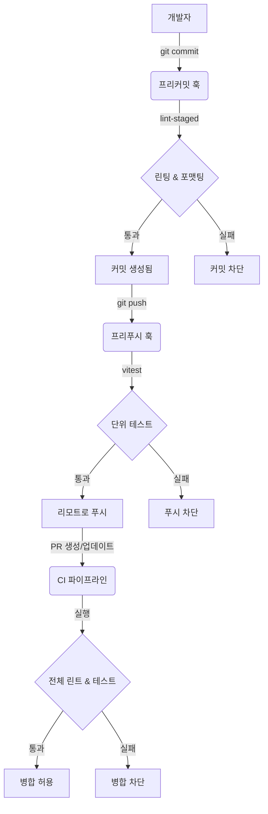

# 기술 구현 계획: 자동화된 코드 품질 워크플로우

**기능**: 자동화된 코드 품질 워크플로우  
**상태**: 초안  
**관련 명세서**: [spec.md](./spec.md)

## 1. 아키텍처 개요

이 기능은 Git 훅과 CI 파이프라인을 사용하는 다계층 품질 제어 시스템을 통합합니다. 이는 개발 수명 주기에서 가능한 한 일찍 오류를 감지하는 "Shift Left" 철학을 따릅니다.

### 고수준 설계

### 컴포넌트 전략

1.  **로컬 환경 (훅)**:
    -   **Husky**: git 훅을 조율합니다.
    -   **lint-staged**: 변경된 파일에서만 실행하여 프리커밋 검사를 최적화합니다.
    -   **ESLint/Prettier**: 코드 스타일을 강제하고 문법 오류를 잡습니다.
    -   **Vitest**: 푸시하기 전에 빠른 단위 테스트를 실행합니다.

2.  **CI 환경 (GitHub Actions)**:
    -   **CI Workflow**: 모든 PR 및 main으로의 푸시에 대해 포괄적인 검사를 실행합니다. 권위 있는 문지기 역할을 합니다.

## 2. 기술 스택

-   **Git Hooks Manager**: `husky` (v9+)
-   **Staged File Linter**: `lint-staged`
-   **Linter**: `eslint` (기존)
-   **Formatter**: `prettier` (기존)
-   **Test Runner**: `vitest` (기존)
-   **CI Provider**: GitHub Actions

## 3. 구현 단계

### 1단계: 로컬 Git 훅 설정

**목표**: 커밋과 푸시를 가로채도록 Husky 및 lint-staged 구성.

1.  **Husky 설치 & 구성**:
    -   루트 디렉토리에 husky 초기화.
    -   `package.json`에 `prepare` 스크립트 추가.

2.  **프리커밋 훅 구성**:
    -   `lint-staged` 설치.
    -   `apps/web`과 `apps/server`를 모두 처리하도록 `.lintstagedrc` 생성 (또는 package.json에서 구성).
    -   규칙: `*/*.{ts,tsx,js,jsx}` -> `eslint --fix`, `prettier --write`.
    -   `lint-staged`를 실행하는 `.husky/pre-commit` 훅 생성.

3.  **프리푸시 훅 구성**:
    -   `.husky/pre-push` 훅 생성.
    -   명령: `pnpm test` 실행 (작업 공간에서 `vitest run` 트리거).
    -   최적화: 가능하면 관련 작업 공간 테스트만 실행하는 것을 고려하되, `pre-push`의 경우 포괄적인 실행이 더 안전함.

### 2단계: CI 파이프라인 개선

**목표**: `ci.yml`이 로컬 훅과 동일한 표준을 엄격하게 시행하도록 보장.

1.  **CI 워크플로우 검증**:
    -   `ci.yml`이 모든 작업 공간 및 패키지에 대해 `lint` 및 `test`를 실행하는지 확인.
    -   (`001`에서 이미 확인되었으나, 일관성 다시 확인).

### 3단계: 모노레포 통합

**목표**: 도구가 `apps/server`, `apps/web` 및 공유 패키지 전반에서 올바르게 작동하도록 보장.

1.  **Lint-staged 구성**:
    -   파일 경로를 올바른 하위 프로젝트 구성에 매핑해야 함.
    -   루트에서 실행되므로 표준 구성 콘텐츠가 이를 잘 처리함.

2.  **테스트 전략**:
    -   루트에서의 `pnpm test`는 일반적으로 모든 작업 공간에서 테스트를 실행함. 너무 느리지 않다면(>30초) 프리푸시로 허용 가능함.

## 4. 작업 로직 및 데이터 흐름

**프리커밋 로직**:
1.  개발자가 `git commit` 실행.
2.  Husky가 `.husky/pre-commit` 트리거.
3.  스크립트가 `npx lint-staged` 호출.
4.  `lint-staged`가 스테이징된 파일 필터링.
5.  파일이 패턴과 일치하면:
    -   `eslint --fix` 실행.
    -   `prettier --write` 실행.
    -   변경 사항 `git add` (수정이 발생한 경우).
6.  종료 코드 0이면 커밋 진행. 아니면 중단.

**프리푸시 로직**:
1.  개발자가 `git push` 실행.
2.  Husky가 `.husky/pre-push` 트리거.
3.  스크립트가 `pnpm test` 실행.
4.  종료 코드 0이면 푸시 진행. 아니면 중단.

## 5. 위험 평가

| 위험 | 영향 | 완화 |
|------|------|------|
| 일부 OS에서 훅 실행 불가 | 개발자가 커밋할 수 없음 | husky가 실행 권한을 설정하는지 확인; Windows/Linux/Mac에서 검증. |
| 프리푸시 검사가 너무 느림 | 개발자 마찰 | 긴급 상황을 위해 우회(`--no-verify`) 허용; 테스트 스위트 성능 최적화. |
| 모노레포 경로 문제 | 잘못된 파일 셋 린팅 | `lint-staged` 구성에서 상대 경로 올바르게 사용. |

## 6. 검증 계획

1.  **로컬 커밋 테스트**: 린트 규칙을 위반하도록 파일 변경, 커밋 시도 -> 실패해야 함.
2.  **로컬 푸시 테스트**: 테스트를 고장내고, 푸시 시도 -> 실패해야 함.
3.  **CI 동등성 테스트**: 로컬 검사를 통과한 PR이 CI도 통과하는지 확인 (동일 규칙).
